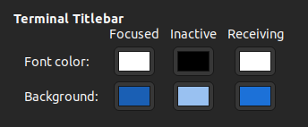

# 📋 TERMINATOR

- [📌 Preferences](#-preferences)
  - [Global](#global)
  - [Profiles](#profiles)

## 📌 Preferences

### Global

Terminal Titlebar:

General:
- `Hide size from title`

Font:
- Uncheck `Use the system font`
- `Ubuntu Regular 12`

### Profiles

Colors:
- Built-in schemes: `White on black`
- `Show bold text in bright colors`